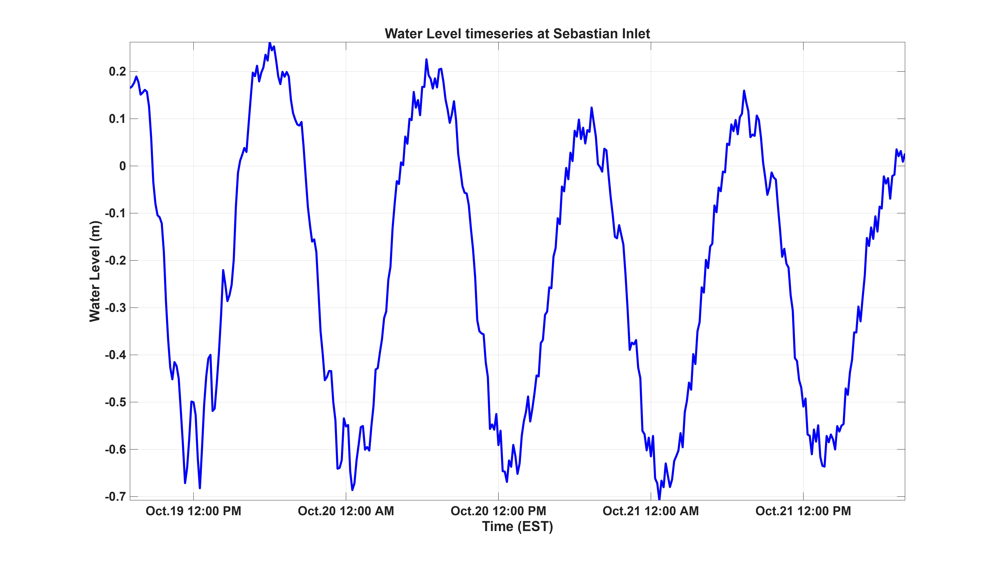
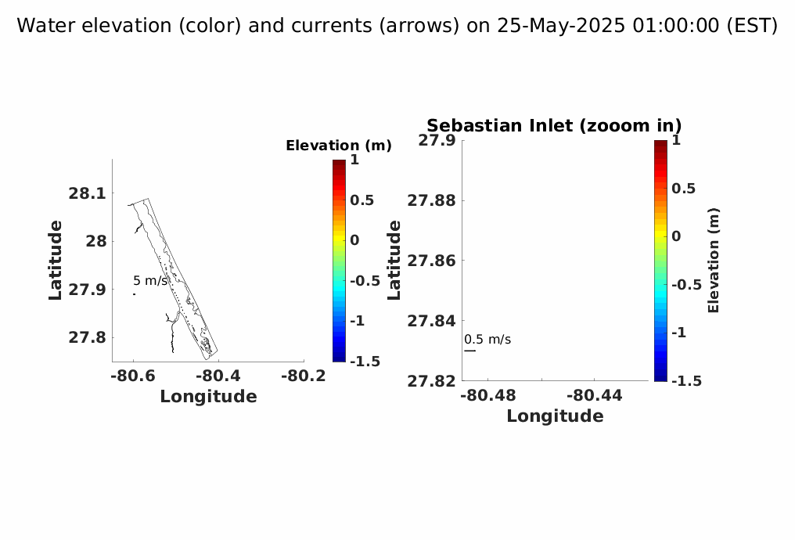

# Model Setup

A numerical model has been developed using <a href="https://oss.deltares.nl/web/delft3d">Delft3D</a>, 3-dimensional modeling suite for hydrodynamics, sediment transport and morphology and water quality for estuarine and coastal environments. A curvilinear orthogonal grid was created with grid size ranging from 14 m in inlet to 475 m in the coastal area and with 5 sigma layers.  The grid represents coastline from Wabasso Beach to Indialantic Beach.

       
# Offshore Boundary Conditions

The model is driven by water elevation time series that includes tides and lower frequency sea level oscillations, and meteorological forcing. The temperature, salinity and sea surface elevation along north, south and east open boundaries were derived from <a href="https://www.hycom.org/data/gomu0pt04/expt-90pt1m000">HYCOM and NCODA Gulf of Mexico 1/25° Analysis</a>. The meteorological forcing (relative humidity, air temperature, wind forcing, heatflux, evaporation and precipitation) was derived from <a href="https://www.ncdc.noaa.gov/data-access/model-data/model-datasets/north-american-mesoscale-forecast-system-nam">North American Mesoscale Forecast system (NAM).</a>
     
# Model Validation

Model results for waterlevel timeseries were compared with data from buoy data near Sebastian Inlet. There is a good match between model results and buoy data for water level timeseries with small difference in amplitude but very good match between phases. Correlation comparison is well over 90%.Following figures show some comparison.

    

 
# Real Time Forecast

3 days of forecast timeseries data has been provided here for LOBO, Sebastian Inlet and North Jetty stations.
  
 
### Parameters Predicted

<ul>
    <li> Salinity</li>
    <li> Temperature </li>
    <li> Currents </li>
    <li> Tidal constituents </li>
    <li> Sig Wave Height</li>
    <li> Wave Direction</li>
    <li> Peak Period</li>
  </ul>

*Water level timeseries forecast at Inlet station for 3 days.*

*Water level timeseries forecast at North Jetty for 3 days.*

*Water level timeseries forecast at LOBO station for 3 days.*

*Water level and Current forecast map.*

### Developed by

Ahsan Habib, PhD Candidate

<a href="https://www.fit.edu/faculty-profiles/8/gary-zarillo/">Dr. Gary Zarillo, PhD </a>

Dept of Ocean Engineering and Marine Sciences

  

 
