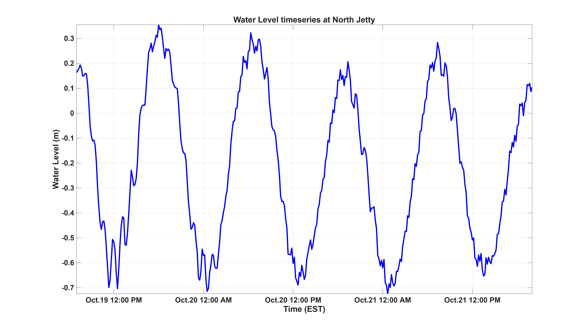
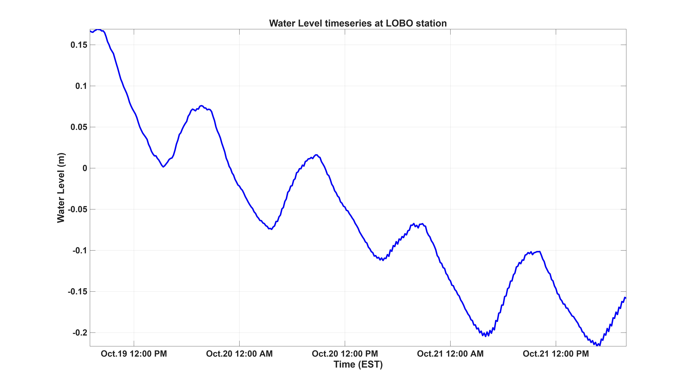
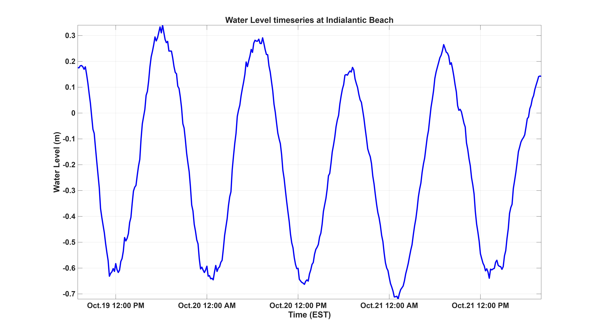
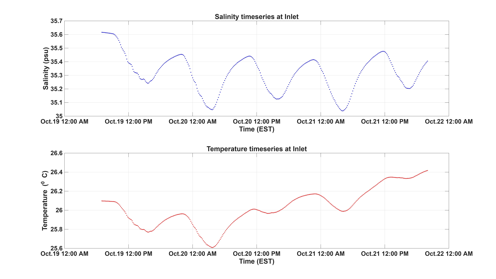
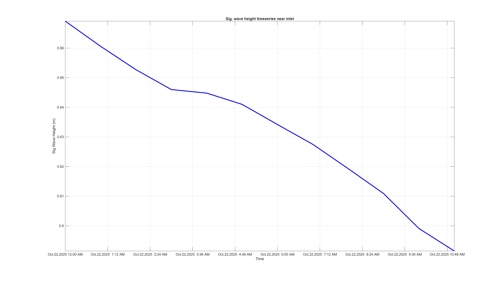
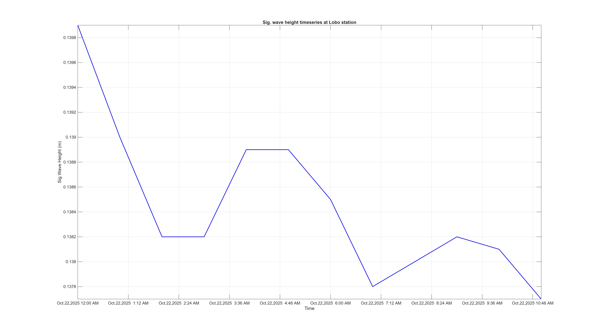
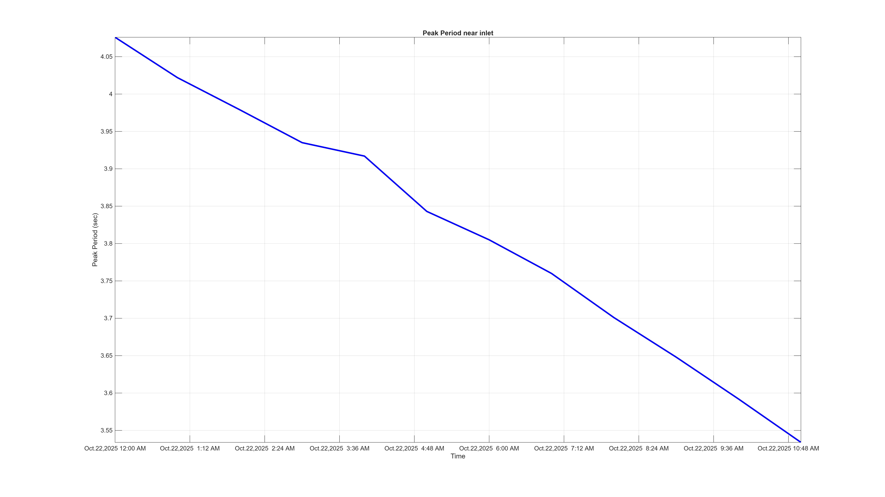
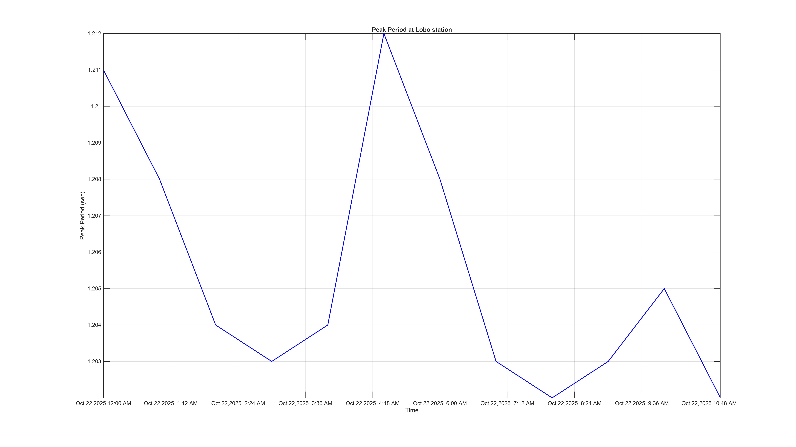

<html>
<body>
             
<h1>Model Setup</h1>

A numerical model has been developed using <a href="https://oss.deltares.nl/web/delft3d">Delft3D</a>, a 3-dimensional modeling suite for hydrodynamics, sediment transport and morphology and water quality for estuarine and coastal environments. A curvilinear orthogonal grid was created with grid size ranging from 14 m in the inlet to 475 m in the coastal area and with 5 sigma layers. The grid represents coastline from Wabasso Beach to Indialantic Beach. Wave model was set up using SWAN (Simulating Waves Nearshore) model suite integrated into Delft3D. Same flow grid and bathymetry were used for wave model setup.  

Left: Model domain (Red rectangular box). Right: Zoomed model domain in Sebastian Inlet.(Google Earth)  
      

Left: Model grid (subsampled one per three grid lines). Right: Detailed grid for Sebastian Inlet area 
      

<h1> Offshore Boundary Conditions </h1>

The model is driven by water elevation time series that includes tides and lower frequency sea level oscillations, and meteorological forcing. The temperature, salinity and sea surface elevation along north, south and east open boundaries were derived from <a href="https://www.hycom.org/data/gomu0pt04/expt-90pt1m000">HYCOM and NCODA Gulf of Mexico 1/25° Analysis</a>. The meteorological forcing (relative humidity, air temperature, wind forcing, heatflux, evaporation and precipitation) was derived from <a href="https://www.ncdc.noaa.gov/data-access/model-data/model-datasets/north-american-mesoscale-forecast-system-nam">North American Mesoscale Forecast system (NAM). </a>
Open boundary conditions for wave model have been derived from global wave model <a href="https://polar.ncep.noaa.gov/waves/ensemble/download.shtml?">WavewatchIII</a>. Significant wave height, peak period, wave direction and direction spreading data were derived from WavewatchIII. 

Temperature and salinity profile at East1 bondary node 
      
  
  

<h1>Model Validation</h1>      

Model results for waterlevel timeseries were compared with data from buoy data near Sebastian Inlet. There is a good match between model results and buoy data for water level timeseries with small difference in amplitude but very good match between phases. Correlation comparison is well over 90%. Salinity. temperature, and sig. waveheight from simulation results were also compared with measured data. These comparisons showed good match with observed data. Following figures show some comparison.

Water level timeseries comparison between model and measured data at Sebastian Inlet 
      
  
  

 

Temperature (left) and Sig. wave height (right) timeseries comparison respectively at LOBO and Sebastian Inlet stations 
      
  
  

<h1> Real Time Forecast </h1>
<h3> Parameters Predicted </h3>
<ul>
    <li>Water level</li>
    <li> Salinity</li>
    <li> Temperature </li>
    <li> Currents </li>
    <li> Sig Wave Height</li>
    <li> Wave Direction</li>
    <li> Peak Period</li>
</ul>

<map name="mapname">
    <area shape="rect" coords="340,410,280,370" href="waterlevel_lobo.jpg" alt="alttext">
    <area shape="rect" coords="430,370,370,320" href="waterlevel_sebastian_inlet.jpg" alt="alttext">
    <area shape="rect" coords="473,461,411,410" href="waterlevel_northjetty.jpg" alt="alttext">
    <area shape="rect" coords="300,55,220,20" href="waterlevel_indialantic.jpg" alt="alttext">
    <area shape="rect" coords="560,540,400,500" href="waterlevel_wabasso.jpg" alt="alttext"> 
 </map>

3 days of timeseries forecast data has been provided here for LOBO, Sebastian Inlet and North Jetty stations 

Water level timeseries forecast at Sebastian Inlet (left) and North Jetty (right) for 3 days

 

3 days Water level timeseries forecast at LOBO station (left) and Indialantic Beach (right).
      

 

3 days forecast of surface salinity and temperature at LOBO station (left) and Sebastian Inlet (right) 
      

Water level and Surface Current forecast map.

Sig. wave height timeseries forecast at Sebastian Inlet (left) and LOBO station (right) 

 

Timeseries forecast of peak period at Sebastian Inlet (left) and LOBO station (right) 

 

 

<h3> Developed by </h3>

 Ahsan Habib, PhD Candidate 

 <a href="https://www.fit.edu/faculty-profiles/8/gary-zarillo/">Dr. Gary Zarillo, PhD </a> 

 Dept of Ocean Engineering and Marine Sciences 

   

</body>
</html>
